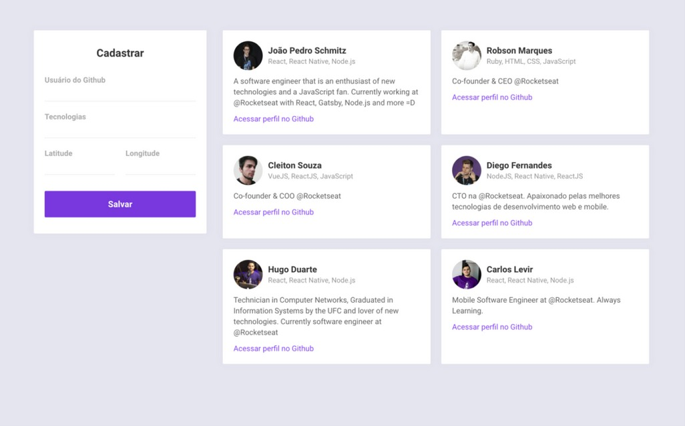

# Recuperação/Segunda Chamada Avaliativa II - Prática

- Curso - Desenvolvimento de Sistemas
- Unidade Curricular - Desenvolvimento de Sistemas
- Docente - Gustavo Roberto de Souza

## Orientações Gerais
- A avaliação deverá ser realizada individualmente.
- Está PROIBIDO uso do CHATGPT para qualquer consulta.
- Não é permitido o uso do celular durante a realização da atividade.
- Conceitos de Frontend.
- A entrega deverá ser feita no AVA. Deve ser enviado apenas o link do repositório do github.

## Passo-a-Passo (Clonar e Entrega)
1. Você deve fazer um fork desse repositório, na parte superior dessa página clique na botão de fork. 
2. Depois disso, você deve clonar o repositório para o seu computador, usando o seguinte comando.
   1. Selecione uma pasta no computador.
   2. Abra o CMD (Terminal).
   3. Execute o seguinte comando `git clone <url_do_repositório>`
3. Abra no seu VS Code a pasta do projeto.
4. Desenvolva os exercícios.
5. Ao finalizar você precisa comittar e enviar novamente para o github suas modificações.
   1. Primeiro precisamos adicionar as alterações ao stage, usando o comando  `git add .`.
   2.  Depois disso, você vai de fato commitar, usando o comando `git commit -m "sua mensagem"`.
   3.  Por fim, você precisa fazer push para o github, com o comando `git push origin master`.
6. Por fim, você deve copiar o link do seu repositório e fazer o envio no AVA. 
   1. Você deve adicionar como comentário na entrega do AVA.

## Atividade
Você como técnico em desenvolvimento de sistemas da empresa XYZ LTDA, ficou responsável por desenvolver um sistema para gerenciamento dos desenvolvedores da empresa. O Projeto é bem simples e deve permitir principalmente criar e remover desenvolvedores da listagem. Você deve utilizar Reactjs para esse projeto. Sobre o desenvolvedor, deve solicitado o Nome completo, tecnologias, Biografia, usuário do github e uma imagem do mesmo. Essas são funcionalidades básicas, caso queira adicionar alguma outra funcionalidade, sinta-se a vontade. Além disso, deve ser aplicado os conceitos API com o JSON-SERVER.

## Exemplos

